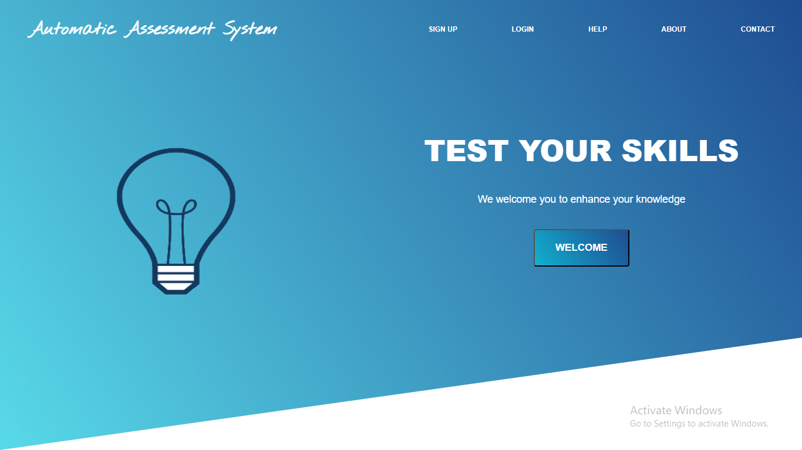

# OCTANET_JUNE
Web Development Internship 2023

## Task Table:
| SN | Task Name | Submission Date | Details(clickable) | Tech Used |
| :---: | :---: | :---: | :---: | :---: |
| 1 | Landing Page | 7 June 2023 | [Task 1](https://github.com/Rahullkumr/OCTANET_JUNE/blob/main/Task_assigned/Task%201.pdf) | HTML, CSS |
| 2 | To Do List | 14 June 2023 | [Task 2](https://github.com/Rahullkumr/OCTANET_JUNE/blob/main/Task_assigned/Task%202.pdf) | HTML, Bootstrap, Flask, SQLite |
| 3 | Clone a Website | 24 June 2023 | [Task 3](https://github.com/Rahullkumr/OCTANET_JUNE/blob/main/Task_assigned/task3.pdf) | HTML, Bootstrap, Flask, SQLite |
 
  
### 1. [Landing Page (HTML, CSS)](https://onlineasystem.000webhostapp.com/)
 

### 2. To do List (HTML, Bootstrap, Flask and SQLite)
 

### 3. Clone a Website
 

#fake
