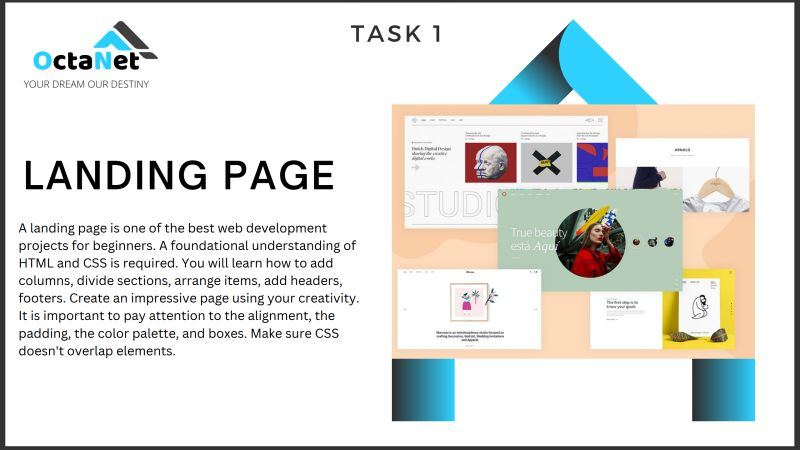

# OCTANET_JUNE
Web Dev Internship 2023

## Task Table:
| SN | Task Name | Details | Submission Date |
| :--- | :--- | :--- | :--- |
| 1 | Landing Page | [Task 1](https://octanet.in/task-1/) | 5 june 2023 |
| 2 |  | [Task 2](https://octanet.in/task-2/) |  |
| 3 |  | [Task 3](https://octanet.in/task-3/) |  |
| 4 |  | [Task 4](https://octanet.in/task-4/) |  |
| 5 |  | [Task 5](https://octanet.in/task-5/) |  |
 
### 1. Landing Page
  
what I built:  
 

### 2. 
  
what I built:  
 

### 3. 
  
what I built:  
 

### 4.
  
what I built:  
 

### 5.
  
